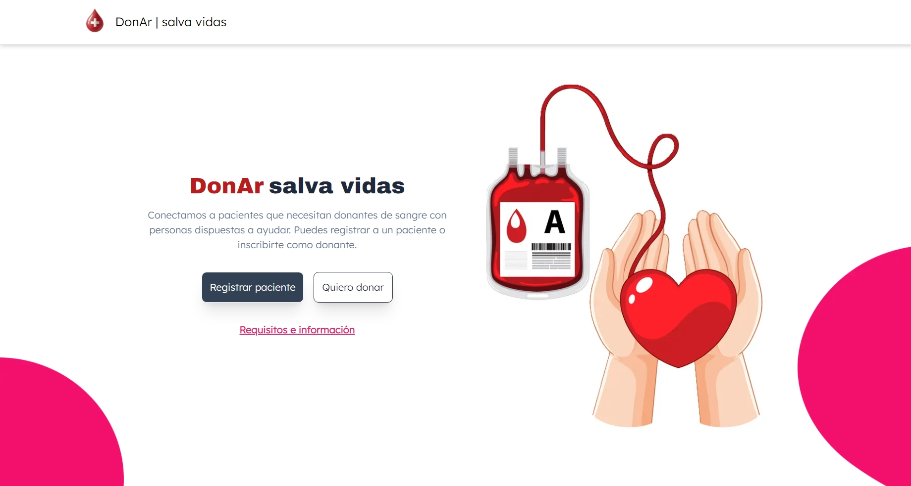

# DonAr | Salva Vidas



Este es un proyecto de [Next.js](https://nextjs.org) que conecta a pacientes que necesitan donantes de sangre con personas dispuestas a ayudar.

## Accede a la app desde el siguiente link:

[DonAr | Salva vidas](https://donar-three.vercel.app/)

## Instrucciones para correr el proyecto localmente

### Requisitos

- Node.js (versión 14 o superior)
- npm (versión 6 o superior)

1. Clona el repositorio:

```bash
git clone https://github.com/Arielstereo/donar.git
```

2. Navega al directorio del proyecto:

```bash
cd donar
```
3. Instala las dependencias:

```bash
npm install
```

4. Crea un archivo .env.local en la raíz del proyecto y agrega las siguientes variables de entorno:

```bash
MONGODB_URI=tu_mongodb_uri
NEXT_PUBLIC_API_BASE_URL=http://localhost:3000/api
```

5. Inicia el servidor de desarrollo:

```bash
npm run dev
```

6. Abre [http://localhost:3000](http://localhost:3000) en tu navegador para ver el proyecto.

